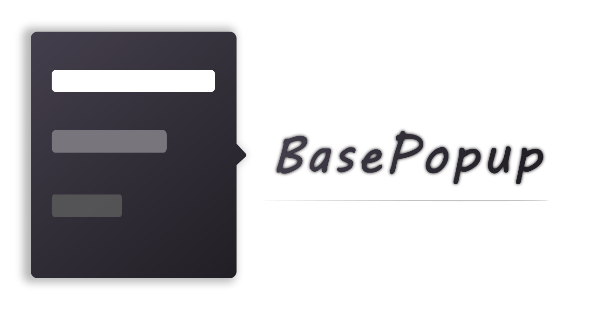

 **中文** | [**English**](./README_V2_EN.md)

<p align="center"></p>
<h2 align="center">BasePopup - Android下打造通用便捷的PopupWindow</h2>
<div align="center">

<table align="center">
        <tr>
            <th align="center" width="9999">Release</th>
            <th align="center" width="9999">Snapshot</th>
            <th align="center" width="9999">License</th>
			<th align="center" width="9999">Api</th>
			<th align="center" width="9999">Author</th>
        </tr>
           <tr>
                    <td align="center">
        				<a href ="https://search.maven.org/artifact/io.github.razerdp/BasePopup">
        					
        				</a>
        			</td>
        			<td align="center">
        				<a href = "https://s01.oss.sonatype.org/content/repositories/snapshots/io/github/razerdp/BasePopup/">
        					
        				</a>
        			</td>
        			<td align="center">
        				<a href = "https://github.com/razerdp/BasePopup/blob/master/LICENSE">
        					
        				</a>
        				<br></br>
        				<a href = "https://github.com/razerdp/BasePopup/blob/master/LICENSE_996">
                        	
                        </a>
        			</td>
        			<td align="center">
        				<a href="https://img.shields.io/badge/Api-16%2B-green.svg">
        					
        				</a>
        			</td>
        			<td align="center">
        				<a href = "https://github.com/razerdp">
        					
        				</a>
        			</td>
        		</tr>
</table>

</div>


---

### 有奖调查问卷：

<a href ="https://wj.qq.com/s2/5468287/c24f"></a>

### 导航
 
 - [特性](#特性)
 - [注意事项](#注意事项)
 - [环境依赖](#环境依赖)
 - [文档](#文档)
   - [BasePopup手册](https://www.yuque.com/razerdp/basepopup)
 - [更新日志](#更新日志-历史更新)
   - [历史更新](https://www.yuque.com/razerdp/basepopup/uyrsxx)
 - [例子预览](#例子预览)
   - [**apk体验下载（密码123）**](https://www.pgyer.com/basepopup)
    
 - [打赏](#打赏看在我那么努力维护的份上给个零食呗)
 - [交流群](#交流群)
 - [常见问题](#常见问题)
 - [LICENSE](#license)
   
<br>

### 特性

 - 本库作为基类，对您的实现没有任何干预，再也不需要担心实现某些方法的时候被Api限制了
 - 无需头疼如何计算offset来进行位置控制，只需要简简单单的设置[**Gravity**](https://www.yuque.com/razerdp/basepopup/qnu3qd)便能随心所欲的控制您的Popup
 - 无论是[**Animation**](https://www.yuque.com/razerdp/basepopup/mg3bcw#onCreateShowAnimation)还是[**Animator**](https://www.yuque.com/razerdp/basepopup/mg3bcw#onCreateShowAnimator)，只需要跟您平时一样写动画，就可以完成Popup的动效设计了，不需要xml不需要关心别的兼容性问题
 - 背景与主体分离，无论是[**背景模糊**](https://www.yuque.com/razerdp/basepopup/udccdq#12bedc89)，亦或是[**背景颜色**](https://www.yuque.com/razerdp/basepopup/gscx3g#aiRz7)，甚至[**把背景换成您的View**](https://www.yuque.com/razerdp/basepopup/gscx3g#e96cp)，都可以通过简单的设置完成，主体与背景隔离，不用担心事件的问题
 - 还在为Popup的触摸事件头疼吗？BasePopup帮你解决烦恼~返回键控制、外部点击透传、点击外部是否消失都只需要您动动手指头完成配置即可
 - PopupWindow自动锚定AnchorView，滑动到屏幕外自动跟随AnchorView消失，不需要复杂的逻辑设置，只需要通过[**linkTo**](https://www.yuque.com/razerdp/basepopup/api)方法告诉BasePopup即可帮您完成
 - 简单的PopupWindow不想新建一个类，希望拥有链式调用？没问题，[**QuickPopupBuilder**](https://www.yuque.com/razerdp/basepopup/ob329t)为此而生，相信你会越用越爱~

<br>

### 注意事项

  - **请务必仔细阅读本README,每个版本升级请务必查阅更新日志，这可以为您减少不必要弯路**
  - **2.2.2版本开始不再支持Support，建议您尽快升级到AndroidX**
  - **请注意引用版本的问题，Release版本是稳定版，Snapshot是预览版。**
    - Release版本：一般在Snapshot版本反复验证修复后发布到Release，如果您对稳定性要求较高，请使用Release版本。
    - Snapshot：一般新功能、issue修复都会发布到Snapshot版本，Snapshot版本发布比较频繁，但通常会拥有新的功能，如果您喜欢试验新功能同时对稳定性要求不高，请使用Snapshot版本。
    - **Release和Snapshot两个版本互相切换可能会导致Build失败，这时候您Clean一下Project即可**
  - **3.0版本是破坏性升级，请您务必阅读升级提示**：[关于BasePopup 3.0的破坏性更新说明](./Update_3.0.md)

<br>

### 环境依赖

#### root gradle配置

```
allprojects {
    repositories {
        mavenCentral() // release依赖仓库（4.1后as默认配置有）
        maven { url 'https://s01.oss.sonatype.org/content/repositories/snapshots' } // snapshot仓库（如果需要snapshot依赖，请配置该maven）
        google()
    }
}
```

#### 依赖

请把下述 **{$latestVersion}** 替换为上面表格中对应的版本。

**由于JCenter已经停止服务，自2.3版本开始，本库将迁移到Maven，新的依赖groupId为 【io.github.razerdp】**

**3.0版本是破坏性升级，请您务必阅读升级提示**：[关于BasePopup 3.0的破坏性更新说明](./Update_3.0.md)

 - **Release：** `implementation 'io.github.razerdp:BasePopup:{$latestVersion}'`
    - e.g.  `implementation 'io.github.razerdp:BasePopup:2.3.0'`
 - **Snapshot：** `implementation 'io.github.razerdp:BasePopup:{$latestVersion_for_snapshot}-SNAPSHOT'`
    - e.g. `implementation 'io.github.razerdp:BasePopup:2.3.2-SNAPSHOT'`

<br>

### 文档

BasePopup配备完善的文档，建议您优先查阅文档。

[**BasePopup手册**](https://www.yuque.com/razerdp/basepopup)

<br>


### 更新日志 [(历史更新)](https://www.yuque.com/razerdp/basepopup/uyrsxx)

* **【Release】3.1.0** (2021/05/28)
    * 本次更新是破坏性更新，更新之前如果您仍处于2.x版本，请务必阅读以下两项事项：
        * 由于JCenter已经停止服务，因此3.0版本开始将会迁移到MavenCentral，新的依赖groupId为【io.github.razerdp】，具体请查看上面的[环境依赖](#环境依赖)
        * 3.0版本是破坏性升级，影响范围为所有BasePopupWindow子类，但修改不会很多，具体请看[关于BasePopup 3.0的破坏性更新说明](./Update_3.0.md)
    * 【优化】
        * 增加api：`hideKeyboardOnShow(boolean)`，是否在BasePopup显示时收起键盘，默认收起
            * demo增加 issue 369测试用例
            * fixed [#369](https://github.com/razerdp/BasePopup/issues/369)
        * 蒙层现在只有点击的时候才会执行dismiss（之前是只判断action_up是否在蒙层内）
            * `onOutSideTouch`增加isMaskPressed标记
    * 【Api修改】
        * 删除**BaseLazyPopupWindow**：往后不需要区分懒加载和正常的BasePopupWindow，统一依赖BasePopupWindow
        * 删除方法`onCreateConstructor`：该方法实际上是给BaseLazyPopupWindow使用的，现在没有了BaseLazyPopupWindow，自然不需要该方法
        * 删除方法`onCreateContentView`：该方法的删除将会影响所有的BasePopupWindow子类，您需要手动去改动
            * 该方法将会被`setContentView(@LayoutRes int layoutResID)`或`setContentView(final View view)`所代替，您需要修改其使用。
            * 如果使用`setContentView(final View view)`，我们依然建议您用setContentView(createPopupById(layoutResID))，以便我们解析到正确的xml配置。
    * 【修复】
        * 修复屏幕旋转后Popup大小没更新的问题
        * 修复`update(float,float)`失效的问题

<br>

### 例子预览

<br>

#### 更多例子请下载Demo：[**apk体验下载（密码123）**](https://www.pgyer.com/basepopup)


<br>

|  |  |  |
| - | - | - |
|  |  |  |
|  |  |  |

<br>

### 打赏（看在我那么努力维护的份上。。。给个零食呗~）


<br>

### 交流群

因公司不能登录QQ，因此解散原QQ群。

同时开通微信群，主要用于交流和BasePopup的反馈，为了保证微信群的质量（主要是远离斗图党和广告党），因此只有打赏了之后才能进群~

【**打赏后请加微信小号：razerdp_test，并注明付款账号，定期核验后会通过**】

<br>

### 常见问题

请查阅[**手册：常见问题**](https://www.yuque.com/razerdp/basepopup/dgf6ry)

<br>

### License

[](https://app.fossa.com/projects/git%2Bgithub.com%2Frazerdp%2FBasePopup?ref=badge_large)

[Apache-2.0](./LICENSE)


<p align="center">
  Visit Count（from 2020/08/19）<br>
  
</p>
